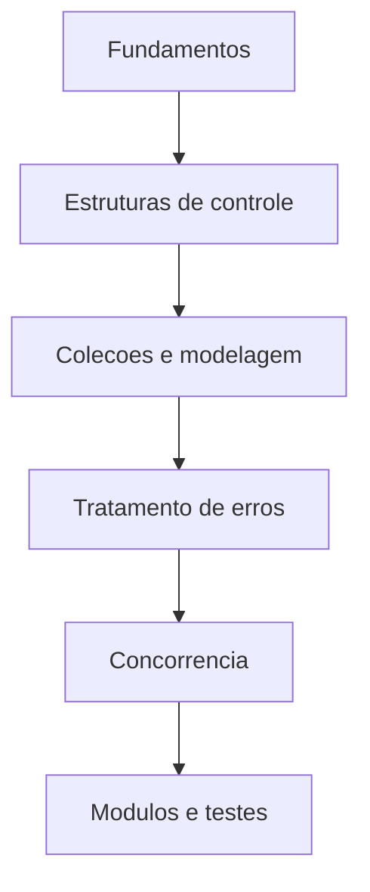

# Documentacao Go - CTT AP2

Bem-vindo ao portal de documentacao da linguagem Go desenvolvido para a AP2.

Este material foi organizado para cobrir os principais fundamentos da linguagem,
com exemplos diretos, boas praticas e foco em estudo colaborativo.

!!! tip "Como navegar"
    Use o menu lateral para seguir a trilha recomendada, da base da linguagem
    ate concorrencia, modulos e testes automatizados.

## Trilha de estudo

| Etapa | Tema | Objetivo |
|---|---|---|
| 1 | Introducao e Instalacao | Preparar ambiente de desenvolvimento |
| 2 | Sintaxe Basica e Variaveis | Entender tipos, declaracoes e escopo |
| 3 | Estruturas de Controle | Dominar `if`, `for` e `switch` |
| 4 | Colecoes | Trabalhar com arrays, slices e maps |
| 5 | Modelagem | Estruturar dados com structs e metodos |
| 6 | Robustez | Tratar erros de forma idiomatica |
| 7 | Concorrencia I | Criar e coordenar goroutines |
| 8 | Concorrencia II | Sincronizar comunicacao com channels |
| 9 | Modulos | Gerenciar dependencias com Go Modules |
| 10 | Testes | Validar comportamento com `go test` |

## Comandos essenciais

```bash
go version
go mod init exemplo.com/app
go run .
go test ./...
```

## Visao de arquitetura do aprendizado


